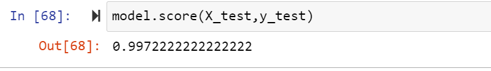

# Handwritten Digits - SVM
This is a project where I use the Machine Learning techiques to recognize handwritten digits. In particular the algorithm "Support Vector Machine" is used, as I have to classify my samples to 10 categories, which means that is a 10-dimension classification problem. 
The dataset consists of 1797 images-samples (10 classes x ~180 samples/class) and is split by 20% - 80% for test and train equivalently.
Each image-sample has 64 pixels (8x8) so is described by a 64-bit ndarray.
### The dataset comes from sklearn.datasets and has the following attributes:
1) DESCR with the description of the dataset.
2) data is a dataframe of 1797x64 with all the pixel values for all images.
3) feature_names has the pixel labels for each 64-bit image i.e [pixel00,pixel01,pixel02....]
4) frame is a DataFrame with data and shape.
5) images is a ndarray with size (1797, 8, 8) with all the images.
6) target_names contains the labels of output (0,1,2,3,4,5,6,7,8,9).
7) target has the output of 1979 hanwritten and size (1797, ).

Below is an example of a 8x8 image with a handwritten digit in grayscale:

The accuracy of the algorithm was around 99.4 with the deafult default Regularity C=1 and gamma = scale. If Regularity is >5 the score drops slightly to 99.72% 
while if gamma is set to auto it drops to 54%.

